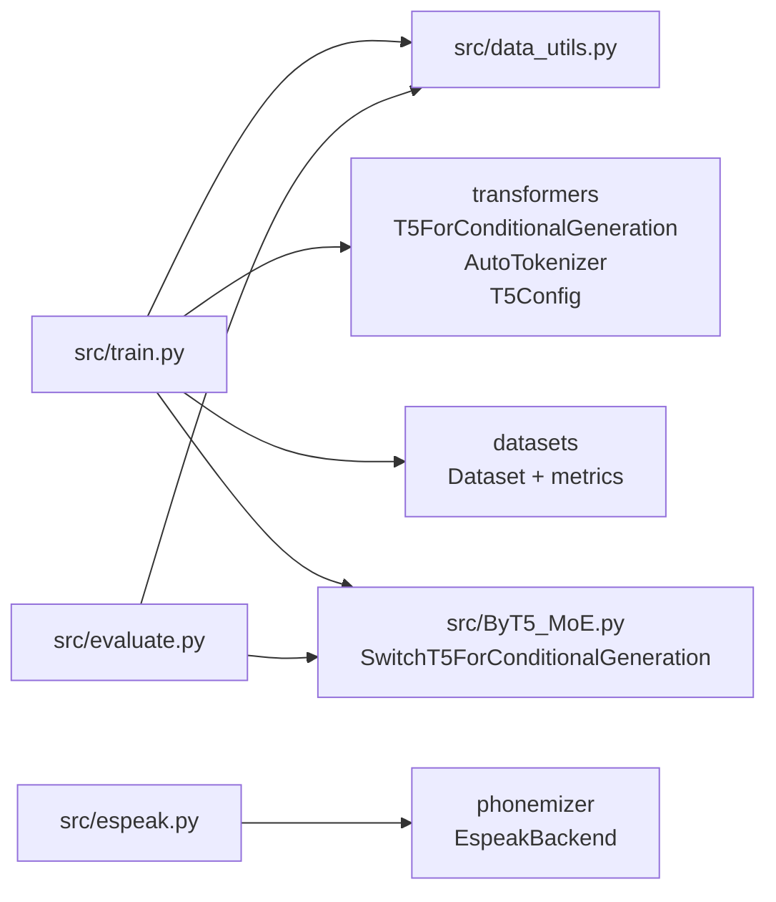

<!--
This document is written for the vendored upstream repo at `external/CharsiuG2P`.
It focuses on how *that* codebase is structured and how its training/eval/inference flows work.
-->

# CharsiuG2P (external/CharsiuG2P) — Theory of Operation

CharsiuG2P is a research codebase for **massively multilingual grapheme-to-phoneme (G2P)** conversion using **byte-level T5 (ByT5)** models. It provides:

- A large collection of pronunciation dictionaries (`dicts/`) and derived train/dev/test splits (`data/`).
- Training and evaluation scripts built on HuggingFace `transformers` + `datasets`.
- An optional **Switch-Transformer-style Mixture-of-Experts (MoE)** encoder implementation (`src/ByT5_MoE.py`).
- Utility scripts to clean sources and generate lexicons (e.g., via `espeak-ng` through `phonemizer`).

## Repository map (what’s “code” vs “assets”)

| Path | Type | Purpose |
|---|---:|---|
| `external/CharsiuG2P/src/train.py` | code | Main training/evaluation entrypoint (Seq2SeqTrainer). |
| `external/CharsiuG2P/src/ByT5_MoE.py` | code | Custom “Switch ByT5” model (MoE FFN in encoder) + load balancing loss. |
| `external/CharsiuG2P/src/data_utils.py` | code | Load dictionaries into HuggingFace `Dataset` objects; apply language prefixes and variant parsing. |
| `external/CharsiuG2P/src/evaluate.py` | code | Alternate evaluation script that loops over languages and writes per-language CER/WER. |
| `external/CharsiuG2P/src/espeak.py` | code | Build a lexicon from a wordlist using `phonemizer`’s `EspeakBackend`. |
| `external/CharsiuG2P/src/partition.py` | code | Split `dicts/` into `data/train`, `data/dev`, `data/test`. |
| `external/CharsiuG2P/src/clean_dicts.py` | code | Filter and normalize raw dictionary sources into `dicts/`. |
| `external/CharsiuG2P/src/clean_wordlist.py` | code | Extract wordlists from frequency lists, filtering digits/non-words. |
| `external/CharsiuG2P/dicts/` | assets | Full pronunciation dictionaries per language (`*.tsv`). |
| `external/CharsiuG2P/data/` | assets | Train/dev/test splits derived from `dicts/` (plus `low_resource/`). |
| `external/CharsiuG2P/sources/` | assets | Raw sources and provenance/license info under `sources/info/`. |
| `external/CharsiuG2P/multilingual_results/` | assets | Saved evaluation outputs (per-language CER/WER) for different models. |
| `external/CharsiuG2P/README.md` | docs | Usage, training commands, and references to the paper/models. |

Notably, `external/CharsiuG2P/src/CharsiuG2P.py` is a **stub** (placeholder classes with `NotImplementedError`) and is not used by the training/eval scripts. Inference is primarily “use `transformers` directly” (as shown in `README.md`).

## Core idea: “byte-level seq2seq” G2P

CharsiuG2P models G2P as a **sequence-to-sequence** task:

- **Input**: a word as a string, prefixed with a language tag (e.g., `<eng-us>:`).
- **Output**: a pronunciation string (IPA-like symbols, stress marks, etc.).

By using **ByT5**, tokenization is done at the **byte** level, which avoids needing language-specific subword vocabularies and makes it practical to cover many scripts/languages in a single model.

### High-level inference flow

```mermaid
flowchart LR
  A[Word list\n(one word per item)] --> B[Add language prefix\n&lt;lang&gt;: + word]
  B --> C[Byte tokenizer\nAutoTokenizer(google/byt5-*)]
  C --> D[T5 seq2seq model\nT5ForConditionalGeneration\nor SwitchT5ForConditionalGeneration]
  D --> E[Decoder\n.generate() / greedy/beams]
  E --> F[Decode bytes to string\nbatch_decode()]
  F --> G[Pronunciation strings\n(IPA-like)]
```

## Data model and I/O formats

### Dictionary file format (`dicts/*.tsv`, `data/*/*.tsv`)

Each line is tab-separated:

| Column | Meaning |
|---:|---|
| 1 | `word` (orthographic form) |
| 2 | `pron` (pronunciation string; sometimes includes comma-separated variants) |

Example (from `external/CharsiuG2P/dicts/eng-us.tsv`):

| word | pron |
|---|---|
| `'cause` | `kəz` |
| `'course` | `ˈkɔɹs` |

### How variants are parsed (`src/data_utils.py`)

`load_pronuncation_dictionary()` and `load_all_pronuncation_dictionaries()` treat any comma in the pronunciation field specially:

- If `pron` contains `,`, then:
  - `pron` becomes the substring before the first comma.
  - `variant` becomes the rest (commas preserved, spaces removed).
- Otherwise `variant` is `''`.

The returned dataset has columns:

| Field | Type | Source |
|---|---|---|
| `word` | string | dictionary `word` (optionally prefixed) |
| `pron` | string | main pronunciation |
| `variant` | string | additional variants (not used for training) |
| `language` | string | file name stem (e.g., `eng-us`) |

### Language prefixes and “unknown language” masking

`data_utils.py` supports adding a prefix:

- If `prefix=True`, then `word` becomes `"<{language}>:" + word`.
- `load_all_pronuncation_dictionaries(..., mask_prob=...)` will sometimes replace the real language with `<unk>:` based on `mask_prob` to encourage robustness across languages.

Important detail: the code in `src/data_utils.py` **does not insert a space after the colon**. The `README.md` examples show a space (`"<eng-us>: "+word`) and warn it “cannot be omitted”; the training loader does not follow that. If you’re reproducing results, follow the behavior of the specific model/checkpoint you’re using (code vs released checkpoints).

## Training & evaluation entrypoint: `src/train.py`

`external/CharsiuG2P/src/train.py` is the main CLI that supports:

- `--train`: build datasets and train a seq2seq model via `Seq2SeqTrainer`.
- `--evaluate`: run `Seq2SeqTrainer.evaluate()` on a test set.

### Module dependency sketch



### Training pipeline (data → collator → trainer)

```mermaid
flowchart TD
  A[TSV dictionaries\n(data/train or dicts)] --> B[data_utils.load_*()\n-> HF Dataset]
  B --> C[prepare_dataset()\nword->input_ids\npron->labels]
  C --> D[DataCollatorWithPadding\nstring->token IDs\nlabels padded to -100]
  D --> E[Seq2SeqTrainer]
  E --> F[Model forward\nCrossEntropy over labels]
  E --> G[Generation-based eval\nCER/WER metrics]
```

### Data collation details (`DataCollatorWithPadding`)

`train.py` defines a custom collator that:

- Tokenizes `words` with `add_special_tokens=False` (treat each “word+prefix” as the whole input).
- Tokenizes `prons` with `add_special_tokens=True` (so targets include EOS etc.).
- Converts target padding tokens to `-100` so HuggingFace’s seq2seq loss ignores padding positions.

### Metrics

`train.py` uses HuggingFace `datasets.load_metric()`:

- `cer` (character error rate)
- `wer` (word error rate)

The model is evaluated by generating predictions (`predict_with_generate=True`) and decoding them back to strings.

### CLI surface (what the flags actually control)

`train.py` exposes a lot of knobs; the important ones map to:

| Flag group | Flags | Effect |
|---|---|---|
| Run mode | `--train`, `--evaluate` | Pick training loop vs evaluation loop. |
| Data selection | `--train_data`, `--dev_data`, `--test_data`, `--language` | Use per-language TSVs or “all languages” directory; `--language` switches loader from “all files in dir” to “single file”. |
| Language tags | `--unk_prob` | During *multilingual* training only, `load_all_pronuncation_dictionaries(..., mask_prob=--unk_prob)` may replace some tags with `<unk>:`. |
| Model family | `--model {byt5,switch}` | Standard T5 vs Switch/MoE encoder. |
| Model init | `--pretrained_model`, `--model_name` | Load a pretrained HF checkpoint vs build from a `T5Config` based on `--model_name` defaults. |
| Architecture | `--num_encoder_layers`, `--num_decoder_layers`, `--d_model`, `--d_kv`, `--d_ff` | Overrides on `T5Config` when *not* loading pretrained weights. |
| Training hyperparams | `--train_batch_size`, `--eval_batch_size`, `--gradient_accumulation`, `--learning_rate`, `--warmup_steps`, `--epochs`, `--fp16` | Standard trainer knobs. |
| Checkpointing/logging | `--output_dir`, `--logging_steps`, `--save_steps`, `--eval_steps`, `--resume_from_checkpoint` | Where and when to save/log/evaluate. |
| Switch/MoE only | `--capacity_factor`, `--n_experts`, `--load_balancing_loss_weight`, `--is_scale_prob`, `--drop_tokens` | Router/experts capacity behavior and auxiliary loss weighting. |

Notes from reading the exact implementation:

- `--unk_prob` naming is slightly confusing: in `data_utils.load_all_pronuncation_dictionaries`, the probability of using `<unk>:` is actually `1 - mask_prob` (because `<unk>:` is chosen when `np.random.uniform() > mask_prob`).
- `--fp16` is documented as “not available for switch transformers” in the help text, but the script still passes it through to `Seq2SeqTrainingArguments(fp16=...)` regardless of model choice.

## Model options

CharsiuG2P supports two model families in training:

| `--model` | Class used | What changes |
|---|---|---|
| `byt5` | `transformers.T5ForConditionalGeneration` | Standard T5/ByT5 seq2seq. |
| `switch` | `SwitchT5ForConditionalGeneration` (`src/ByT5_MoE.py`) | Encoder FFN becomes MoE (Switch Transformers style) with load-balancing loss. |

### Custom ByT5 config (non-default layer sizes)

When **not** loading a pretrained checkpoint (`--pretrained_model False`), `train.py` builds a `T5Config` and overrides:

- `config.num_layers` (encoder layers) via `--num_encoder_layers`
- `config.num_decoder_layers` via `--num_decoder_layers`
- `config.d_model`, `config.d_kv`, `config.d_ff` via flags

This is how the repo creates “tiny” variants (e.g., 8/12/16-layer encoders with reduced dimensionality).

## Switch/MoE encoder: `src/ByT5_MoE.py`

`external/CharsiuG2P/src/ByT5_MoE.py` is a fork of HuggingFace’s T5 modeling code with a key modification:

- The **encoder stack** is replaced with `T5SwitchStack`, composed of `T5SwitchBlock`s.
- Each `T5SwitchBlock` uses `T5SwitchLayerFF`, whose FFN is a `SwitchFeedForward` module (a router + many FFN “experts”).
- The **decoder** remains a standard `T5Stack`.

### Switch routing behavior (per token)

```mermaid
flowchart LR
  X[Token embedding x\n(d_model)] --> R[Router linear layer\nswitch(x)->logits]
  R --> S[Softmax\nroute_prob]
  S --> M[argmax route\npick expert i]
  M --> E1[Expert 1 FFN]
  M --> E2[Expert 2 FFN]
  M --> EN[Expert N FFN]
  E1 --> Y[Expert output]
  E2 --> Y
  EN --> Y
  Y --> P[Optional scaling\n* route_prob_max]
  P --> O[Output embedding\n(d_model)]
```

Key mechanics implemented in `SwitchFeedForward.forward()`:

- **Top-1 routing**: each token goes to the single highest-probability expert.
- **Capacity**: each expert has a fixed capacity: `capacity = int(capacity_factor * tokens / n_experts)`.
- **Dropping** (optional): if `drop_tokens=True`, tokens beyond capacity are “dropped” (passed through unchanged).
- **Scaling** (optional): if `is_scale_prob=True`, expert outputs are scaled by the selected routing probability.

### Load balancing loss

The MoE model adds an auxiliary load-balancing term (weighted by `lambda_`) during training:

- `encoder_outputs` carry routing stats (`counts`, `route_prob`, etc.) through a `switch_params` field.
- `SwitchT5ForConditionalGeneration.forward()` computes:
  - `route_frac = counts / total_tokens`
  - `route_prob = route_prob_sum / total_tokens`
  - `load_balancing_loss = n_experts * sum(route_frac * route_prob)`
  - `loss = cross_entropy + lambda_ * load_balancing_loss`

This encourages routing to use experts more evenly.

## Evaluation flows

There are two evaluation implementations:

1) `src/train.py --evaluate`
- Uses `Seq2SeqTrainer.evaluate()` on one combined test dataset (either all languages or a single language if `--language` is provided).

2) `src/evaluate.py`
- Manually iterates through each `*.tsv` file in a test directory, runs generation, and appends `lang\tCER\tWER` to an output file (like the artifacts under `multilingual_results/`).

Implementation note: `evaluate.py --zero_shot` tries to feed an “unknown language” prefix, but it passes `language='<unk>:'` into `load_pronuncation_dictionary(..., prefix=True)`, which then wraps it again as `<<unk>:>:`. Treat `evaluate.py` as a convenient experiment script rather than a polished interface.

## Dataset partitioning and lexicon generation

### `src/partition.py`

Splits each `dicts/<lang>.tsv` into:

- `data/test/<lang>.tsv`: first 500 entries
- `data/dev/<lang>.tsv`: next 50 entries
- `data/train/<lang>.tsv`: remaining entries

It also removes spaces inside pronunciations (`line[1].replace(' ','')`).

### `src/espeak.py`

Builds a TSV lexicon from a wordlist using the `phonemizer` project’s `EspeakBackend`:

- Input: newline-delimited words (`--path`)
- Output: `word\tphonemes` pairs (`--outpath`)
- Uses `with_stress=True` and `tie=True` (IPA formatting choices).

### `src/clean_dicts.py` and `src/clean_wordlist.py`

Utility scripts for normalizing raw sources into consistent wordlists/dictionaries:

- `clean_dicts.py`: filters entries with parentheses in pronunciation and strips spaces.
- `clean_wordlist.py`: extracts words from frequency lists (threshold `--cutoff`), filters out digits and non-word symbols.

## Outputs and artifacts

### Training outputs

`train.py` uses `Seq2SeqTrainingArguments(output_dir=...)` and saves:

- checkpoints during training (`save_steps`)
- final model via `trainer.save_model(output_dir)`

### Results files

The repo’s saved evaluation outputs under `multilingual_results/` are line-based TSV files:

`<language>\t<CER>\t<WER>`

These are produced by scripts like `src/evaluate.py` (or notebooks).

## Practical notes / quirks in this vendored snapshot

- `external/CharsiuG2P/src/CharsiuG2P.py` is not implemented; the “API” is the `transformers` model + tokenizer pattern shown in `README.md`.
- `external/CharsiuG2P/src/model.py` and `external/CharsiuG2P/src/g2p.py` read like scratch/one-off scripts (they reference undefined variables or hard-coded paths) rather than reusable modules.
- `external/CharsiuG2P/lang_list.txt` contains duplicates in this snapshot; treat it as informational rather than authoritative.
