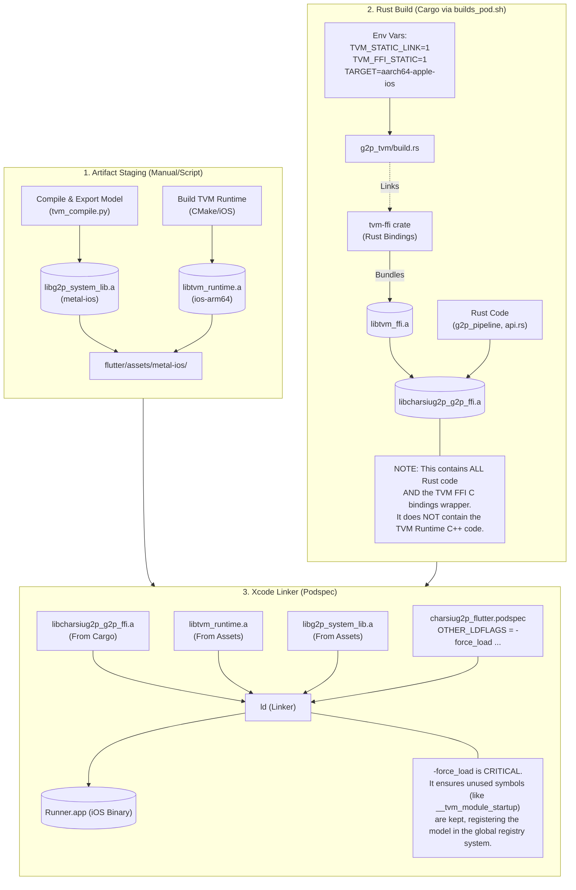

# iOS Build Integration: The Static Linking Flow

This document visualizes how the CharsiuG2P project integrates Rust, TVM, and Flutter for iOS builds. The key challenge is handling **static linking** (`.a` files) because iOS does not support dynamic loading of custom libraries easily, and TVM's `system-lib` feature requires manual symbol registration.

## Build Flow Diagram

## Key Components

1.  **`libg2p_system_lib.a`**: The "Bytecode" of your model + generated C functions for operators. It registers itself via a global constructor (`__tvm_module_startup`).
2.  **`libtvm_runtime.a`**: The C++ engine that knows how to run the bytecode.
3.  **`libcharsiug2p_g2p_ffi.a`**: The bridge. It contains:
    *   The compiled Rust code.
    *   The `tvm-ffi` C bindings (tiny wrapper).
    *   It calls into `libtvm_runtime` functions (unresolved symbols at this stage).
    *   It tries to load modules from the "System Lib" registry (populated by component #1).

## The Linker's Job

The final link step merges all three.
*   Rust code calls `TVMFuncCall`.
*   Linker finds `TVMFuncCall` in `libtvm_runtime.a`.
*   Rust code calls `ExtensionNode::GetGlobal("ffi.SystemLib")`.
*   Runtime looks up "g2p_" prefix.
*   Because we used `-force_load` on `libg2p_system_lib.a`, its startup function ran and registered "g2p_..." in the runtime's internal map.
*   **Success!** The model loads as if it were a dynamic library.
