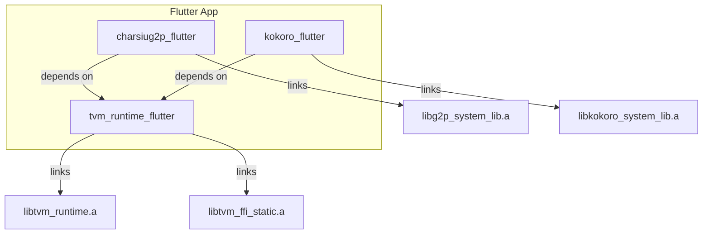

# Shared TVM Runtime Flutter Plugin Architecture

> **Branch**: `feat/tvm-flutter-integration`
> **Date**: December 2025
> **Status**: Design approved, ready for implementation

---

## Context for New Agents

### What is this project?
`charsiug2p-tvm` is a Flutter plugin for grapheme-to-phoneme (G2P) conversion using TVM-compiled neural networks. It uses static linking on iOS (TVM `system-lib` mechanism) and dynamic linking on Android.

### Current State
- iOS static linking is **working** with these components:
  - `libtvm_runtime.a` - TVM runtime (currently bundled in `flutter/assets/metal-ios/`)
  - `libtvm_ffi_static.a` - TVM FFI bindings (path set via `TVM_FFI_LIB_DIR` in `build_pod.sh`)
  - `libg2p_system_lib.a` - Compiled G2P model (in `flutter/assets/metal-ios/`)

### Key Files to Reference
| File | Purpose |
|------|---------|
| `flutter/ios/charsiug2p_flutter.podspec` | Current iOS linking config with `-force_load` flags |
| `flutter/cargokit/build_pod.sh` | Sets `TVM_STATIC_LINK=1` and `TVM_FFI_LIB_DIR` for iOS |
| `flutter/rust/src/api.rs` | FRB API with `use_system_lib` flag |
| `rust/g2p_tvm/build.rs` | Rust build script that reads TVM env vars |
| `NOTES/IOS_BUILD_PROCESS.md` | Diagram of current iOS build flow |
| `NOTES/TVM_RELAX_STATIC_LINKING.md` | Static linking notes and known limitations |

### Why Refactor?
The current design bundles TVM runtime inside `charsiug2p_flutter`. If another TVM-based plugin (e.g., `kokoro_flutter` for TTS) is added, the linker fails with duplicate symbols.

---

## Problem Statement

When multiple Flutter plugins use TVM (e.g., `charsiug2p_flutter` + `kokoro_flutter`), static linking causes **duplicate symbol errors** because each plugin tries to link `libtvm_runtime.a`.

## Proposed Solution

Create a **shared runtime plugin** (`tvm_runtime_flutter`) that owns the TVM runtime. Model-specific plugins depend on it.



---

## Plugin Responsibilities

| Plugin | Owns | Links |
|--------|------|-------|
| `tvm_runtime_flutter` | TVM runtime, FFI bindings | `libtvm_runtime.a`, `libtvm_ffi_static.a` |
| `charsiug2p_flutter` | G2P model, Rust bindings | `libg2p_system_lib.a` (model only) |
| `kokoro_flutter` | TTS model, Rust bindings | `libkokoro_system_lib.a` (model only) |

---

## iOS Linking Strategy

### `tvm_runtime_flutter.podspec`
```ruby
Pod::Spec.new do |s|
  s.name = 'tvm_runtime_flutter'
  s.vendored_libraries = 'libs/libtvm_runtime.a', 'libs/libtvm_ffi_static.a'
  s.pod_target_xcconfig = {
    'OTHER_LDFLAGS' => '-force_load ${PODS_TARGET_SRCROOT}/libs/libtvm_runtime.a ' +
                       '-force_load ${PODS_TARGET_SRCROOT}/libs/libtvm_ffi_static.a',
    'HEADER_SEARCH_PATHS' => '${PODS_TARGET_SRCROOT}/include'
  }
  s.frameworks = 'Metal', 'Foundation', 'MetalPerformanceShaders'
end
```

### `charsiug2p_flutter.podspec` (Updated)
```ruby
Pod::Spec.new do |s|
  s.name = 'charsiug2p_flutter'
  s.dependency 'tvm_runtime_flutter'  # <-- Key change
  
  # Only link model-specific static lib
  s.pod_target_xcconfig = {
    'OTHER_LDFLAGS' => '-force_load ${PODS_TARGET_SRCROOT}/../assets/metal-ios/libg2p_system_lib.a'
  }
end
```

---

## Android Linking Strategy

Android uses dynamic linking (`.so`), which naturally avoids symbol collisions:

- `tvm_runtime_flutter` packages `libtvm_runtime.so` in `jniLibs/`.
- Model plugins package their own `lib<model>_system_lib.so`.
- JNI loads them at runtime; no duplicate symbol issues.

---

## Rust Crate Structure

```
tvm_runtime_flutter/
├── rust/
│   └── src/lib.rs       # Re-exports tvm-ffi, runtime init
└── ios/
    └── tvm_runtime_flutter.podspec

charsiug2p_flutter/
├── rust/
│   └── src/api.rs       # Model-specific API
├── ios/
│   └── charsiug2p_flutter.podspec  # depends on tvm_runtime_flutter
└── assets/
    └── metal-ios/
        └── libg2p_system_lib.a
```

---

## Key Benefits

1. **No duplicate symbols**: TVM runtime linked once.
2. **Independent model updates**: Update `charsiug2p_flutter` without touching TVM runtime.
3. **Smaller model plugins**: Models don't bundle the 10MB+ runtime.
4. **Clear separation of concerns**: Runtime vs. model logic.

---

## Migration Path

1. **Create `tvm_runtime_flutter`** with TVM runtime/FFI binaries.
2. **Refactor `charsiug2p_flutter`**:
   - Remove TVM runtime from assets.
   - Add `dependency 'tvm_runtime_flutter'` to podspec.
   - Update `build_pod.sh` to not set `TVM_FFI_LIB_DIR` (handled by runtime plugin).
3. **Test** with example app.
4. **Document** for other plugin authors.

---

## Open Questions

1. **Version coordination**: How to ensure compatible TVM versions across plugins?
   - *Suggestion*: Semantic versioning on `tvm_runtime_flutter`.

2. **Rust crate dependency**: Should model plugins depend on a shared `tvm-ffi` crate?
   - *Suggestion*: Yes, via Cargo workspace or published crate.

3. **System-lib prefix collisions**: What if two plugins use the same prefix?
   - *Suggestion*: Enforce unique prefixes per plugin (e.g., `g2p_`, `kokoro_`).

---

## Implementation Checklist

### Phase 1: Create `tvm_runtime_flutter` Plugin
- [ ] Create new Flutter plugin: `flutter create --template=plugin tvm_runtime_flutter`
- [ ] Add `ios/libs/` directory with:
  - [ ] `libtvm_runtime.a` (from `/Users/yunhocho/GitHub/kokoro-tvm/reference/tvm/build-ios/lib/`)
  - [ ] `libtvm_ffi_static.a` (from same location)
- [ ] Write `tvm_runtime_flutter.podspec`:
  - Set `vendored_libraries` to the `.a` files
  - Set `-force_load` in `OTHER_LDFLAGS`
  - Link Metal frameworks
- [ ] Minimal Rust crate that re-exports `tvm-ffi` (optional, for shared FFI types)
- [ ] Publish to local path or private registry

### Phase 2: Refactor `charsiug2p_flutter`
- [ ] Remove `libtvm_runtime.a` from `flutter/assets/metal-ios/`
- [ ] Update `flutter/ios/charsiug2p_flutter.podspec`:
  - Add `s.dependency 'tvm_runtime_flutter'`
  - Remove TVM runtime/FFI from `OTHER_LDFLAGS`
  - Keep only `libg2p_system_lib.a`
- [ ] Update `flutter/cargokit/build_pod.sh`:
  - Remove hardcoded `TVM_FFI_LIB_DIR` (tvm_runtime_flutter handles it)
- [ ] Update `rust/g2p_tvm/build.rs` if needed (may need shared crate)

### Phase 3: Testing
- [ ] Build example app with refactored plugin
- [ ] Verify no duplicate symbol errors
- [ ] Run G2P inference on iOS device
- [ ] (Future) Add second TVM plugin to verify coexistence

---

## Testing Strategy

```bash
# 1. Clean build
cd flutter/example
flutter clean
rm -rf ios/Pods ios/Podfile.lock

# 2. Rebuild
flutter pub get
cd ios && pod install && cd ..

# 3. Run on device
flutter run --release
```

**Expected Result**: App builds without duplicate symbol errors and G2P inference works.

---

## External Dependencies

| Artifact | Source Location | Notes |
|----------|-----------------|-------|
| `libtvm_runtime.a` (iOS) | `kokoro-tvm/reference/tvm/build-ios/lib/` | ~10MB, Metal-enabled |
| `libtvm_ffi_static.a` (iOS) | Same as above | TVM FFI bindings |
| `libg2p_system_lib.a` | Generated by `tvm_compile.py --target metal-ios` | Model-specific |

