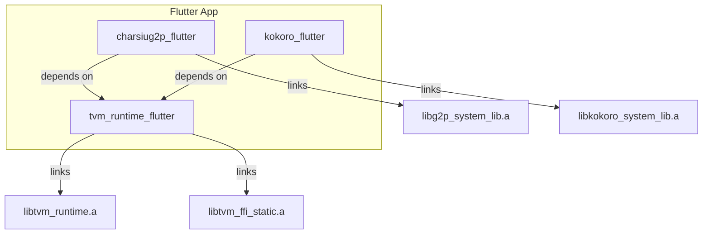

# Shared TVM Runtime Flutter Plugin Architecture

## Problem Statement

When multiple Flutter plugins use TVM (e.g., `charsiug2p_flutter` + `kokoro_flutter`), static linking causes **duplicate symbol errors** because each plugin tries to link `libtvm_runtime.a`.

## Proposed Solution

Create a **shared runtime plugin** (`tvm_runtime_flutter`) that owns the TVM runtime. Model-specific plugins depend on it.



---

## Plugin Responsibilities

| Plugin | Owns | Links |
|--------|------|-------|
| `tvm_runtime_flutter` | TVM runtime, FFI bindings | `libtvm_runtime.a`, `libtvm_ffi_static.a` |
| `charsiug2p_flutter` | G2P model, Rust bindings | `libg2p_system_lib.a` (model only) |
| `kokoro_flutter` | TTS model, Rust bindings | `libkokoro_system_lib.a` (model only) |

---

## iOS Linking Strategy

### `tvm_runtime_flutter.podspec`
```ruby
Pod::Spec.new do |s|
  s.name = 'tvm_runtime_flutter'
  s.vendored_libraries = 'libs/libtvm_runtime.a', 'libs/libtvm_ffi_static.a'
  s.pod_target_xcconfig = {
    'OTHER_LDFLAGS' => '-force_load ${PODS_TARGET_SRCROOT}/libs/libtvm_runtime.a ' +
                       '-force_load ${PODS_TARGET_SRCROOT}/libs/libtvm_ffi_static.a',
    'HEADER_SEARCH_PATHS' => '${PODS_TARGET_SRCROOT}/include'
  }
  s.frameworks = 'Metal', 'Foundation', 'MetalPerformanceShaders'
end
```

### `charsiug2p_flutter.podspec` (Updated)
```ruby
Pod::Spec.new do |s|
  s.name = 'charsiug2p_flutter'
  s.dependency 'tvm_runtime_flutter'  # <-- Key change
  
  # Only link model-specific static lib
  s.pod_target_xcconfig = {
    'OTHER_LDFLAGS' => '-force_load ${PODS_TARGET_SRCROOT}/../assets/metal-ios/libg2p_system_lib.a'
  }
end
```

---

## Android Linking Strategy

Android uses dynamic linking (`.so`), which naturally avoids symbol collisions:

- `tvm_runtime_flutter` packages `libtvm_runtime.so` in `jniLibs/`.
- Model plugins package their own `lib<model>_system_lib.so`.
- JNI loads them at runtime; no duplicate symbol issues.

---

## Rust Crate Structure

```
tvm_runtime_flutter/
├── rust/
│   └── src/lib.rs       # Re-exports tvm-ffi, runtime init
└── ios/
    └── tvm_runtime_flutter.podspec

charsiug2p_flutter/
├── rust/
│   └── src/api.rs       # Model-specific API
├── ios/
│   └── charsiug2p_flutter.podspec  # depends on tvm_runtime_flutter
└── assets/
    └── metal-ios/
        └── libg2p_system_lib.a
```

---

## Key Benefits

1. **No duplicate symbols**: TVM runtime linked once.
2. **Independent model updates**: Update `charsiug2p_flutter` without touching TVM runtime.
3. **Smaller model plugins**: Models don't bundle the 10MB+ runtime.
4. **Clear separation of concerns**: Runtime vs. model logic.

---

## Migration Path

1. **Create `tvm_runtime_flutter`** with TVM runtime/FFI binaries.
2. **Refactor `charsiug2p_flutter`**:
   - Remove TVM runtime from assets.
   - Add `dependency 'tvm_runtime_flutter'` to podspec.
   - Update `build_pod.sh` to not set `TVM_FFI_LIB_DIR` (handled by runtime plugin).
3. **Test** with example app.
4. **Document** for other plugin authors.

---

## Open Questions

1. **Version coordination**: How to ensure compatible TVM versions across plugins?
   - *Suggestion*: Semantic versioning on `tvm_runtime_flutter`.

2. **Rust crate dependency**: Should model plugins depend on a shared `tvm-ffi` crate?
   - *Suggestion*: Yes, via Cargo workspace or published crate.

3. **System-lib prefix collisions**: What if two plugins use the same prefix?
   - *Suggestion*: Enforce unique prefixes per plugin (e.g., `g2p_`, `kokoro_`).
